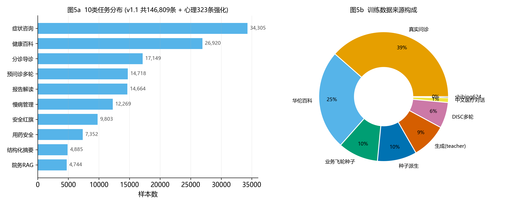
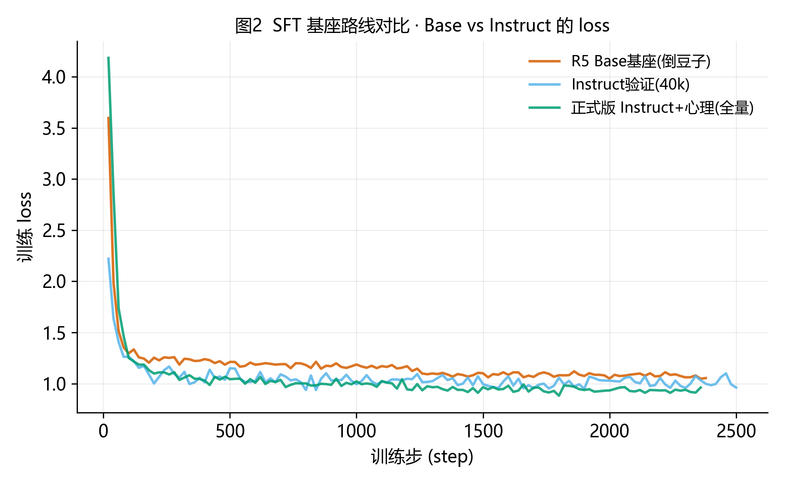
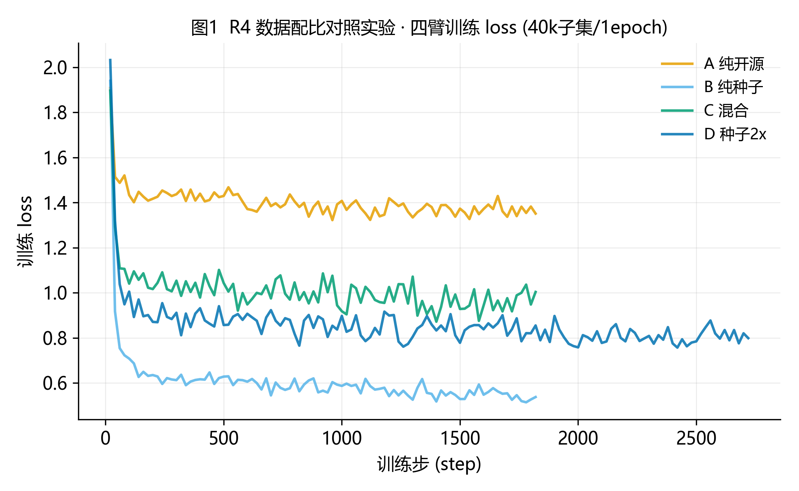
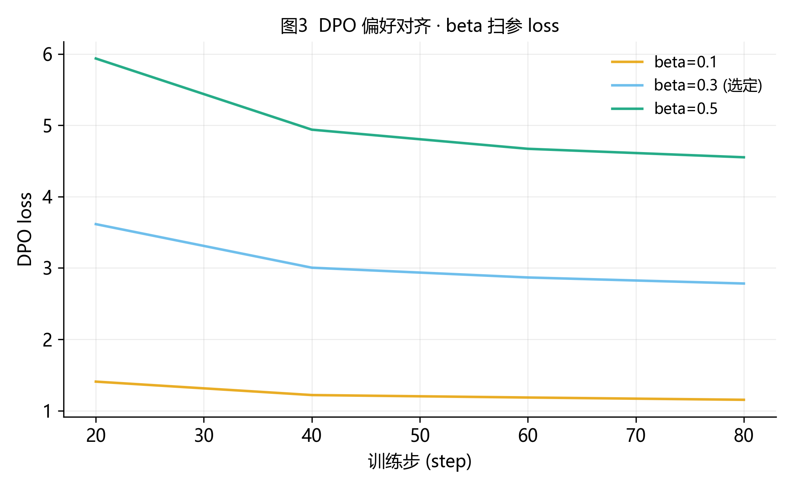
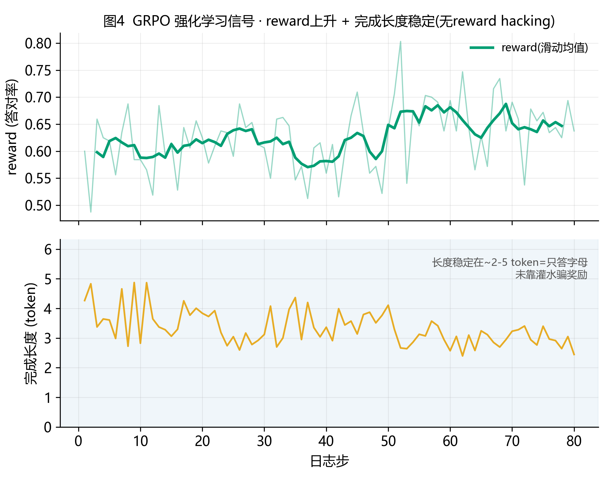
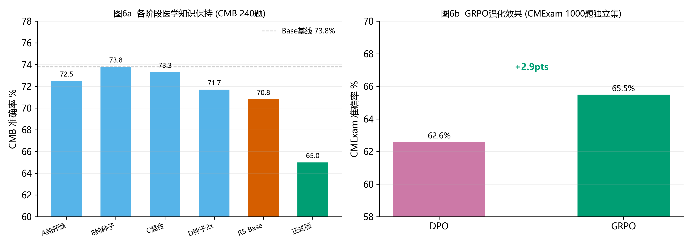

# 医疗预问诊大模型:SFT → DPO → GRPO 全链路对齐

> **从零构建一个中文医疗预问诊助手,端到端复现大模型对齐的完整 RLHF 链路。**
> 数据工程 → 监督微调(SFT) → 直接偏好优化(DPO) → 可验证奖励强化学习(GRPO / RLVR)。
> 基座 **Qwen3-8B** · 硬件 H20(超参扫描)+ 4×RTX 5090(全量训练与 RLHF)。

---

## 摘要 (Abstract)

本项目端到端实践了大模型对齐的完整 RLHF 链路,并在过程中获得若干可迁移的工程与方法论发现。
从 217 万条医疗语料的备选池出发,经受控数据管线构建出 **10 类任务均衡、安全感知**的 SFT 数据集(154,476 条);
监督微调阶段发现 **"基座-模板匹配"是对话能力的决定因素**——裸 Base 基座即使充分训练也无法学会停止(倒豆子),
换 Instruct 基座 + 无思考模板后彻底解决;DPO 阶段用**双 API 裁判**构造偏好数据改善心理危机应对;
GRPO 阶段以**规则奖励(答对=1)**做可验证强化学习,选择题正确率 **+2.9pts 且无 reward hacking、对话行为无损**。

---

## 1. 数据工程

管线:`统一schema → 清洗 → task_type分类 → 跨源去重 → 配比采样`,以业务种子数据为锚点做配比,业务数据不被开源数据淹没。评测集(CMB/CMExam)严格隔离于训练集。

*图1 · 最终 SFT 数据集:10 类任务分布(左)与多源构成(右)。真实问诊 + 华佗百科 + 业务飞轮种子 + teacher 生成混合。*

---

## 2. 监督微调 (SFT) · 核心发现:基座与模板匹配

超参扫描(rank/lr/挂载层)与数据配比对照(四臂 A/B/C/D)确定最优配置后,全量训练暴露出**倒豆子**问题:模型一次生成多轮问答+结论、伴乱码复读。逐一排除欠训练、停止符配置、数据污染后,**根因锁定为 Base 裸基座缺乏对话对齐 + 思考模板注入**。换 **Qwen3-8B-Instruct + qwen3_nothink 模板**后彻底解决。

*图2 · SFT 基座路线对比。Base 基座(橙)即使 loss 降到 1.055 仍倒豆子;Instruct 基座(绿/蓝)loss 更低且对话流畅。*

> **原理**:预训练 Base 只学"续写",未建立 `<|im_end|>`(对话轮结束)的语义;SFT 要从零教这个特殊 token,数据量再大也难稳。Instruct 版经官方对齐已内建此机制。**当初为 CPT 选 Base,但 CPT 实测无提升而放弃 → SFT 就应用 Instruct。**

展开:R4 数据配比对照 · DPO beta 扫参

*R4 四臂数据配比对照 loss(40k子集)。混合配方综合最均衡。*

*DPO beta 扫参。三版差异小(稳定),人工对比实际输出后选 beta=0.3。*

---

## 3. 直接偏好优化 (DPO)

用 SFT 模型自采样 K=4 候选,**MiniMax-M3 + DeepSeek 双 API 裁判**排序组 chosen/rejected(内置长度偏置防护),得 1,434 条偏好对。效果:心理危机场景从 SFT 的"平静问持续多久"改善为 **"我很担心你…我在这里陪着你"(共情 + 引导专业帮助)**。

---

## 4. 可验证奖励强化学习 (GRPO / RLVR)

以 CMExam 医学选择题"答对=1、答错=0"为**规则奖励**(无需奖励模型),四卡 400 步。

*图3 · GRPO 强化信号。reward 平滑上升(0.60→0.68),完成长度稳定在 2–5 token(只答字母,未靠灌水骗奖励)—— **无 reward hacking**。*

---

## 5. 评测结果

*图4 · 左:各阶段医学知识保持(CMB 240题)。右:**GRPO 在 CMExam 独立评测集 62.6% → 65.5%(+2.9pts)**,且对话行为无损。*

---

## 6. 方法论(可迁移经验)

1. **小验证再放量** — 小数据定方向,省全量试错(base-vs-instruct 用 40k 验证即定论)
2. **多维度评测,交互测试不可替代** — 脚本五场景全绿,真实对话两句即暴露幻觉+跳步
3. **reward hacking 监控** — 盯 reward + 完成长度,长度不暴涨才敢采用
4. **基座-模板匹配** — chat SFT 用 Instruct 基座 + 匹配模板,不用裸 Base
5. **统计纪律** — 先测 seed 噪声底(σ≈0.0007),再判断效应是否真实

---

## 7. 局限与后续

当前模型:分诊科室欠准、跑题不纠偏、首轮闲聊会幻觉——均为数据覆盖问题。
**架构演进(工业界主流)**:Router + 共享基座多 LoRA 专才 + 对话状态机;工程进阶 veRL/vLLM 推训分离。

---

## 目录结构

| 目录 | 内容 |
|---|---|
| **[analysis/REPORT.md](analysis/REPORT.md)** | **完整实验报告(方法+结果+原理)** |
| `analysis/figures/` | 6 组图表(PNG 300dpi)+ 画图脚本 |
| `analysis/archive/` | 11 条训练 loss 原始日志 + 各阶段评测日志 |
| `scripts_cloud/` | 全部脚本:数据管线 / 训练 / 评测 / DPO / GRPO / 服务 |
| `configs_cloud/` | 全部训练配置 |
| `docs/` | 全程时间线 CLOUD_RUN_LOG / EXPERIMENT_LOG / VERL_SETUP_LOG |

> 模型权重(基座 + SFT/DPO/GRPO adapter)因体积未入库。
