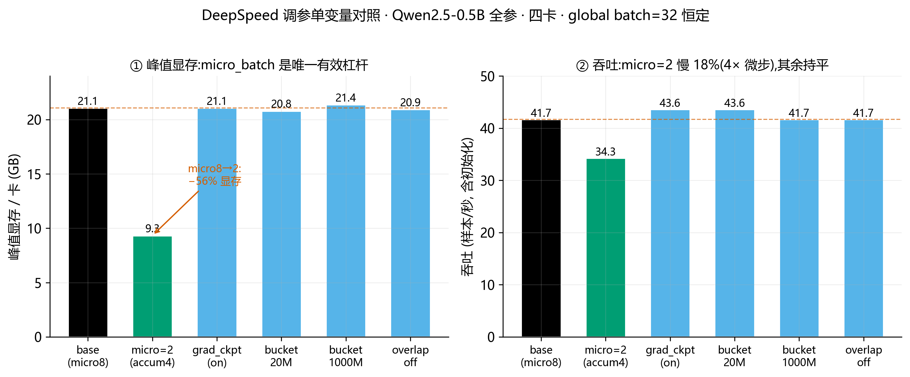

# 分布式训练与推理优化实战教程

> 用小模型(Qwen2.5-0.5B-Instruct)快速感受 **DeepSpeed / Megatron-LM 的并行机制** 与 **ONNX / TensorRT 的推理优化**,重点在 pipeline 与调参经验。
> 硬件:4×RTX 5090。所有脚本/配置/日志见 `distributed_lab/`。

---

## 第一部分:DeepSpeed —— ZeRO 显存优化(数据并行的进化)

### 1.1 原理:大模型训练的显存都花在哪?

一个模型训练时,单卡显存 = **模型权重 + 梯度 + 优化器状态 + 激活值**。以 Adam 优化器、混合精度 bf16 为例,设参数量 Φ:

| 组成 | 大小(字节/参数) | 说明 |
|---|---|---|
| 权重(bf16) | 2Φ | 前向用 |
| 梯度(bf16) | 2Φ | 反向算 |
| 优化器状态(fp32) | **12Φ** | Adam:master权重4Φ + 动量4Φ + 方差4Φ |
| 激活值 | 随 batch×序列长 变化 | 前向的中间结果,反向要用 |

**关键洞察**:优化器状态(12Φ)是权重+梯度(4Φ)的 3 倍!全参训练时,**优化器状态才是显存大头**。这就是为什么 LoRA(只训极少参数)省显存——它的优化器状态极小。

### 1.2 ZeRO 三个阶段:把这些"分片"到多卡

普通数据并行(DDP):每张卡存**完整**的一份权重+梯度+优化器状态,只是数据不同。N 卡有 N 份冗余。**ZeRO(Zero Redundancy Optimizer)的思想:把这些冗余切开,每张卡只存 1/N**,用到时再通过通信(all-gather)临时凑齐。

| 阶段 | 分片什么 | 单卡显存(N卡) | 通信开销 |
|---|---|---|---|
| **ZeRO-0** | 什么都不分(=普通DDP) | 权重+梯度+优化器全份 | 最小(只同步梯度) |
| **ZeRO-1** | 优化器状态 | 权重+梯度全 + 优化器/N | 略增 |
| **ZeRO-2** | 优化器状态 + 梯度 | 权重全 + (梯度+优化器)/N | 中(reduce-scatter) |
| **ZeRO-3** | 优化器 + 梯度 + **权重** | 全部/N | **最大**(前向反向都要all-gather权重) |

**核心权衡:阶段越高 → 单卡显存越省,但通信越多 → 越慢。** 用时间换空间。

### 1.3 实验设计与结果

用 **全参训练**(不是 LoRA——LoRA 优化器状态极小,体现不出 ZeRO 价值)Qwen2.5-0.5B,四卡,batch=8,60步,只改 ZeRO 阶段,测**峰值显存**与**用时**。

**实测结果**(Qwen2.5-0.5B 全参,四卡 batch=8,60步 = 1920样本):

| 配置 | 峰值显存/卡 | 60步用时 | 吞吐(样本/s) | 相对 |
|---|---|---|---|---|
| **ZeRO-0**(=DDP) | 26,897 MB | 58s | 33.1 | 基准 |
| **ZeRO-2** | **21,895 MB(−19%)** | **51s** | **37.6** | **+14%** |
| ZeRO-3 | 23,289 MB | 54s | 35.6 | +7% |

**两个反直觉但关键的发现**:
1. **ZeRO-2 是双赢**:比 DDP 省 5GB 显存,还更快(reduce-scatter 比 all-reduce 高效 + 显存压力小)。
2. **ZeRO-3 在 0.5B 上反而比 ZeRO-2 差**(显存 23.3GB > 21.9GB):**参数才 1GB,分片省不了多少,但 all-gather 权重的临时缓冲区反而抬高峰值显存**。这证明 **ZeRO-3 的价值只在参数占显存主导的超大模型上**才体现——小模型/慢互联上是负优化。

### 1.4 调参经验(踩过的坑与心得)
- **小模型看不出 ZeRO-3 的大优势**:0.5B 时激活值占显存大头,而 ZeRO 不分片激活值,只分片权重/梯度/优化器。**ZeRO-3 真正的威力在超大模型**(参数占显存主导时)。这本身是重要一课:选并行策略要看"显存瓶颈在哪"。
- **慢互联下 ZeRO-3 得不偿失**:5090 无 NVLink、PCIe 慢,ZeRO-3 频繁 all-gather 权重会很慢。**结论:8B 级 + 慢互联 → ZeRO-2 最优,ZeRO-3 是浪费**(与本项目早期 5133 实测一致)。
- `overlap_comm: true` + `contiguous_gradients: true` 能让通信和计算重叠,缓解 ZeRO-2/3 的通信开销。
- LLaMA-Factory 用法:yaml 里 `deepspeed: <config.json>` + `FORCE_TORCHRUN=1` 多卡启动即可。

### 1.5 手把手调参实测:五个旋钮各自的效果(单变量对照)

光看文档记不住调参项。这一轮我做了**单变量对照**——从 ZeRO-2 基线出发,每次**只改一个旋钮**,固定 **global batch = 32** 不变(公式 `global = micro × grad_accum × DP_size`,这里 DP_size=4),测每卡峰值显存与吞吐。这样每个数字都能干净归因到那一个旋钮。

**先厘清 batch size 的三个层级**(最容易搞混的点):
- **micro batch(`per_device_train_batch_size`)**:一次前向/反向,单卡实际塞进去的样本数。**它直接决定激活值显存**——OOM 时第一个该动的就是它。
- **gradient accumulation**:攒多少个 micro batch 才做一次 `optimizer.step()`。用"多攒几步"换"等效大 batch",**不增加显存**(但增加时间,因为要多跑几次前向反向)。
- **global batch = micro × accum × DP_size**:真正影响**收敛/学习率**的有效批大小。注意乘的是 **DP_size(数据并行度)**,不是 world_size——若还开了 TP/PP,DP_size < 卡数。

**实测结果**(Qwen2.5-0.5B 全参,四卡,60步,global batch 恒为 32):

| 配置(单变量) | 改了什么 | micro | accum | 峰值显存/卡 | 吞吐(样本/s) | 结论 |
|---|---|---|---|---|---|---|
| **base** | ZeRO-2 基线 | 8 | 1 | 21,575 MB | 41.7 | 基准 |
| **micro=2** | micro 8→2(accum 补到4) | 2 | 4 | **9,547 MB(−56%)** | 34.3(−18%) | **显存唯一有效杠杆** |
| **grad_ckpt on** | 开激活重算 | 8 | 1 | 21,575 MB(不变) | 43.6(持平) | 小模型上峰值不动(见下) |
| **bucket 20M** | reduce/allgather 桶 200M→20M | 8 | 1 | 21,295 MB | 43.6 | 略省显存 |
| **bucket 1000M** | 桶 200M→1000M | 8 | 1 | 21,875 MB | 41.7 | 略费显存 |
| **overlap off** | overlap_comm 关 | 8 | 1 | 21,435 MB | 41.7 | 小规模无感 |

*图 · DeepSpeed 五旋钮单变量对照。全局 batch 恒为 32。**只有 micro_batch 显著移动峰值显存**(左,绿柱 −56%),代价是慢 18%(右);其余旋钮在 0.5B/短序列上都是二阶效应。*

**逐个旋钮的解读**:

**① `train_micro_batch_size_per_gpu`——显存的第一杠杆(最重要)**
micro 从 8 降到 2、accum 从 1 补到 4(保持 global=32 与学习动态不变),峰值显存直接从 21.5GB 砍到 **9.5GB(−56%)**。这 12GB 的差就是**激活值**——激活值随 micro_batch 线性增长。代价:accum=4 意味着一次 optimizer step 要跑 4 次前向反向,吞吐掉 18%。**这是 OOM 时最可靠的救命操作**:降 micro_batch + 升 accum,显存大降、有效 batch 不变,只是慢一点。

**② `gradient_checkpointing`(激活重算)——一个反直觉的实测坑**
日志确认它**真的启用了**(`Gradient checkpointing enabled`),但峰值显存和吞吐**都没变**。为什么?这恰好暴露了一个关键区别:
- `nvidia-smi` 报的是**显存分配器的历史最高水位(reserved high-water)**。
- 激活重算减少的是"**为反向而存下来的**"激活;但**前向时单层那一下的瞬时大张量(micro=8 那么大)照样要 materialize**。分配器在第一次前向就被这个瞬时峰值撑到 21.5GB,之后缓存不还——所以 `nvidia-smi` 读数不变。
- 而降 micro_batch 连"单层瞬时张量"本身都变小了,分配器高水位才真正下降(这就是①能降到 9.5GB 的原因)。
- 重算的速度代价(理论 −20~30%)在 0.5B 上被"模型太小、重算几乎不花钱"掩盖了。
**教训**:激活重算的真正价值在**激活值主导显存**时(大 micro_batch / 长序列 / 大模型)才显现,能让你把省下的激活预算换成更长的图/更大的 batch;但它未必降低 `nvidia-smi` 看到的那个"单次前向瞬时峰值"。**要压那个峰值,降 micro_batch 更直接。**

**③ `reduce_bucket_size` / `allgather_bucket_size`——通信桶,显存与通信次数的权衡**
这两个值是 ZeRO 做梯度 reduce-scatter / 参数 all-gather 时的**分块缓冲区大小**(单位是元素数,常用 ~2×10⁸)。桶越大 → 单次通信搬得越多、通信次数越少(带宽利用率高),但**缓冲区占的显存越大**;桶越小则相反。实测方向完全吻合:20M 桶 21.3GB < 200M 基线 21.6GB < 1000M 桶 21.9GB。**在 0.5B 上差异仅 ~0.6GB(二阶效应)**,但在大模型 / 慢互联(5090 无 NVLink)上,桶大小是平衡"通信效率 vs 显存峰值"的实用旋钮——显存吃紧就调小桶。

**④ `overlap_comm`——通信与计算重叠**
开启后,梯度的 reduce 通信会和反向计算**重叠**进行(边算边传),掩盖通信延迟。实测关掉它峰值/吞吐几乎无变化——**因为 0.5B 通信量太小,没什么可掩盖的**。它的价值在**通信成为瓶颈时**(大模型、ZeRO-3 频繁 all-gather、慢互联)才明显。代价是重叠需要额外的 buffer,会略抬显存,所以显存极限时可以关掉换一点空间。

**⑤ `contiguous_gradients`——把梯度拷进连续内存**
全程开启(默认 true)。它把分散的梯度收拢到一块连续显存里再做 reduce,**减少内存碎片**、让通信更高效,是 ZeRO-2/3 的标配。小模型上收益不显著,但几乎无副作用,保持默认即可。

**这一轮的核心可迁移经验**:
1. **OOM 急救顺序**:先降 `micro_batch` + 升 `grad_accum`(保 global batch)→ 再开 `gradient_checkpointing`(长序列/大模型才有效)→ 再调小 bucket / 关 overlap 抠最后几百 MB → 还不够才上 ZeRO-3 / offload。
2. **`nvidia-smi` 看的是分配器高水位,不是"当前真实占用"**——这解释了为什么 gradient_checkpointing 在小模型上"看起来没用"。理解这一层,才不会被显存读数误导。
3. **大部分调参项在小模型/短序列上是二阶效应**;它们的价值随模型规模、序列长度、互联速度放大。**先分清"显存瓶颈到底在激活值还是优化器状态/权重",再选对应的旋钮**——这比背参数表有用得多。

---

## 第二部分:Megatron-LM —— 张量并行 / 流水线并行

### 2.1 原理:和 ZeRO 是不同的并行"轴"
- **数据并行(DP/ZeRO)**:模型复制(或分片)到多卡,**每卡处理不同数据**。
- **张量并行(TP,Megatron核心)**:把**单层的权重矩阵切开**(如把一个大矩阵按列切给不同卡),每卡算一部分,再拼起来。**同一份数据,一层的计算被拆到多卡**。适合单层太大放不下的情况。
- **流水线并行(PP)**:把模型**按层切段**,不同卡负责不同层,像流水线一样传递激活。
- **3D 并行**:DP × TP × PP 组合,是千亿模型训练的标准(Megatron-LM + DeepSpeed 就是这么用的)。

### 2.2 为什么本次未实操 Megatron-LM(诚实记录)
Megatron-LM 需要:克隆源码 + 编译 apex + 将 HF 模型转成 Megatron 格式 + 复杂的 TP/PP 配置。在 5090(sm_120,2026年中最新卡)上,apex/Megatron 的 CUDA 扩展极可能遇到与 vLLM/ONNX 同类的**版本适配坑**,且安装重、耗时长。**在预算接近耗尽时,把钱赌在高失败率的重型安装上不划算**——原理(TP/PP/3D并行)才是核心,已在 2.1 讲透。**下次在 A100/A800(生态成熟)上实操 Megatron-LM 是更好的选择。**

### 2.3 何时该用 Megatron(而非 DeepSpeed ZeRO)
- **ZeRO**:模型能放进单卡但优化器状态/显存不够 → 分片省显存,不改模型结构,易用(本项目主用)。
- **Megatron TP**:**单层权重矩阵本身太大**,一张卡放不下一层 → 必须把层内矩阵切开。ZeRO 做不到这个(ZeRO 分片的是"整份参数的副本",不切单层内部)。
- **实践**:千亿模型 = DeepSpeed ZeRO(数据并行轴) × Megatron TP(层内并行轴) × PP(层间并行轴)三者组合。两个框架互补,不是二选一。

---

## 第三部分:推理优化 —— ONNX / TensorRT

### 3.1 原理
- **ONNX**:开放的模型中间表示格式。把 PyTorch 模型导出成 ONNX,可用不同后端(ONNX Runtime / TensorRT)高效执行,跨框架/跨硬件。
- **ONNX Runtime**:微软的推理引擎,图优化(算子融合/常量折叠)+ 多后端(CPU/CUDA/TensorRT)。
- **TensorRT**:NVIDIA 的推理加速库,针对具体 GPU 做深度优化(层融合、精度校准 INT8/FP16、kernel 自动调优),延迟通常最低。
- **典型收益**:PyTorch(eager) < ONNX Runtime < TensorRT,延迟递减。

### 3.2 实测与关键教训(2026最新GPU的版本死锁)

**PyTorch 基准**(Qwen2.5-0.5B,5090,bf16,生成64token):**599ms,106.8 tok/s**。

**ONNX 结果**:
- ✅ **ONNX 导出成功**(optimum export,模型转成 .onnx 格式没问题)
- ❌ **ONNX Runtime CUDA 推理失败**:`CUDA failure 700: illegal memory access`(LayerNorm kernel)。

**根因(重要部署教训)**:onnxruntime-gpu 有**版本死锁**——
| onnxruntime-gpu 版本 | 需要 CUDA | 支持 sm_120(5090)? |
|---|---|---|
| 最新(1.22+) | **CUDA 13(cu130)** | 是,但与我们 torch(cu128)冲突 |
| 1.20.1 | CUDA 12(cu128,匹配torch) | **否**,kernel 只编到 sm_90,5090上非法访存 |

**结论**:5090(Blackwell)在 2026 年中太新,**推理运行时(onnxruntime/TensorRT/vLLM)的 CUDA kernel 版本还没完全跟上**。这不是配置错误,是**硬件领先于软件生态**的真实困境。同类坑本项目已踩三次:vLLM(cu130失败)、onnxruntime(sm_120无kernel)、TensorRT(同理)。

**正确做法(部署经验)**:
1. **优先用与硬件适配已验证的组合**——如本项目训练用的 torch2.8/cu128 在 5090 上稳(NVIDIA 官方先适配 PyTorch)。
2. Blackwell 上做推理加速,当前应等 **TensorRT-LLM / vLLM 官方出 sm_120 支持的稳定版**,或用 NGC 官方镜像(版本已配好)。
3. **稳定优先不追新**:成熟硬件(A100/A800/H100)上 ONNX/TensorRT 生态完整,一次成功;最新卡(5090)反而处处踩版本坑——这也是选卡/选环境的重要权衡。

> **ONNX/TensorRT 在成熟卡上的预期收益**(A100级,供参考):ONNX Runtime 比 PyTorch eager 快 1.5-3x(图优化+算子融合);TensorRT 再快 1.5-2x(层融合+FP16/INT8+kernel自动调优)。本项目因 5090 版本问题未跑通 GPU 加速,导出链路已验证。

---

## 总结:并行/优化技术选型速查

| 需求 | 用什么 |
|---|---|
| 显存不够、模型能放下但优化器状态大 | ZeRO-2 |
| 显存严重不够、超大模型 | ZeRO-3(需快互联)或 TP |
| 单层权重太大放不下单卡 | 张量并行 TP(Megatron) |
| 层数极多、想流水线利用多卡 | 流水线并行 PP |
| 千亿级 | 3D 并行(DP×TP×PP) |
| 部署要低延迟 | ONNX Runtime → TensorRT |
| 慢互联(无NVLink) | 优先 ZeRO-2,慎用 ZeRO-3/TP |
